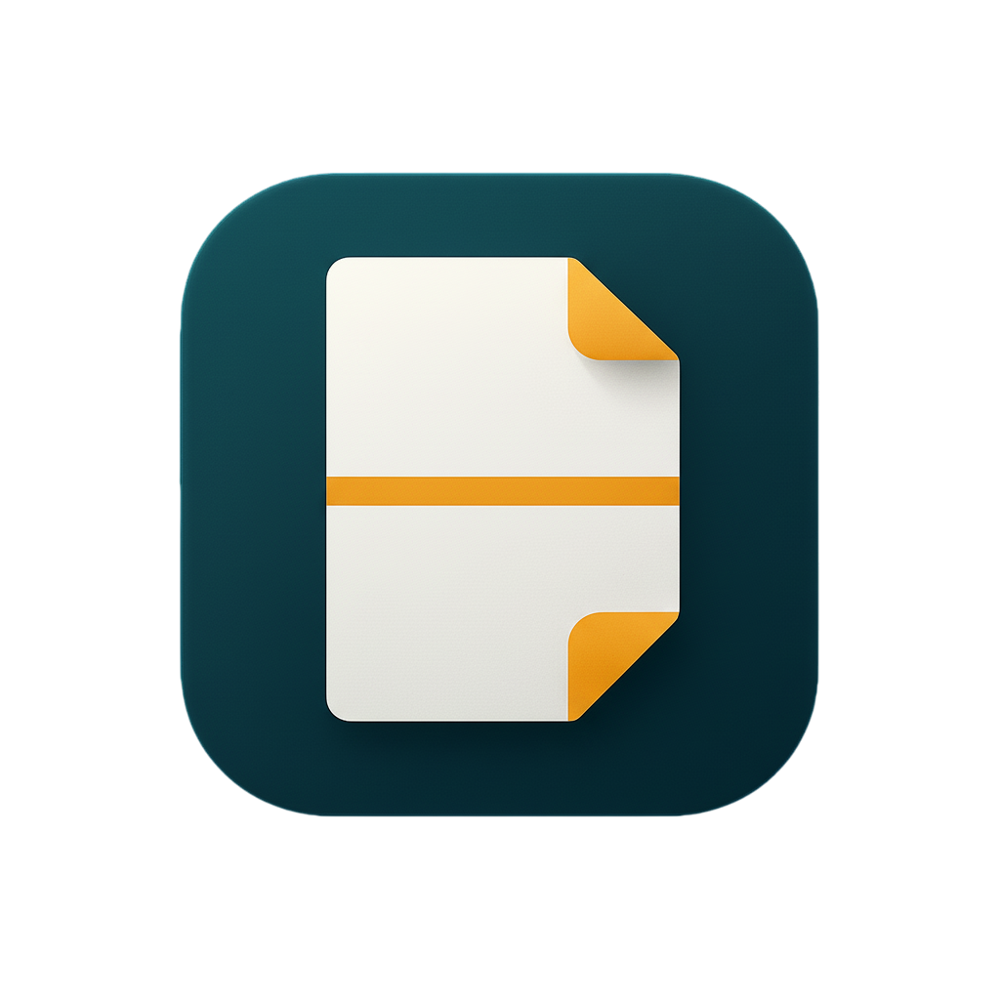

<p align="center">
  <a href="https://egu1832.github.io/dual-pdf-viewer/">
    
  </a>
</p>

<h3 align="center">Dual PDF Viewer</h3>

<p align="center">
  Compare two PDF files vertically in your browser —<br>
  with scroll synchronization, zoom controls, and offset fine-tuning.<br><br>
  <b>v1.3.0 (Release)</b>
  <br>
  <a href="https://egu1832.github.io/dual-pdf-viewer/"><strong>Open Live Demo »</strong></a>
  <br><br>
  <a href="https://github.com/egu1832/dual-pdf-viewer/issues/new?labels=bug&template=bug_report.yml">Report bug</a>
  ·
  <a href="https://github.com/egu1832/dual-pdf-viewer/issues/new?labels=enhancement&template=feature_request.yml">Request feature</a>
</p>

---

## Tech Stack


## Directory Structure
```
Obsidian2Github/
├── README.md
├── app.js
├── index.html
└── style.css
```

## Features
- Load top/bottom PDF files locally
- Zoom in/out
- Scroll synchronization toggle
- Adjustable offset between PDFs
- Works entirely client-side (no server required)

## Security
All PDF files are processed **locally** using `PDF.js`.  
No data is uploaded or stored on any server.

## Live Demo
Once published on GitHub Pages, open:
https://egu1832.github.io/dual-pdf-viewer/

## License
MIT License — free for personal and educational use.