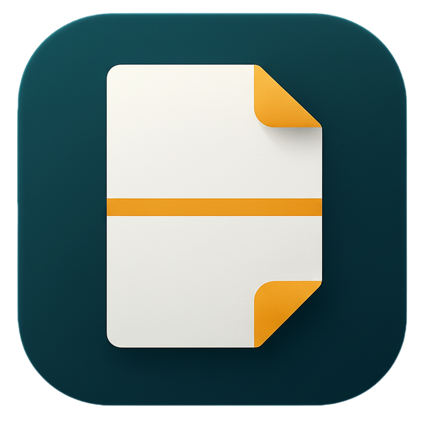

<p align="center">
  
</p>

<p align="center">
  <span style="font-size: 2em; font-weight: bold;">Dual PDF Viewer</span><br>
  Compare two PDF files side-by-side in your browser —<br>
  with scroll synchronization, zoom controls, and offset fine-tuning.<br><br>
  <b>v1.3.0 (Release)</b>
</p>

## 🔧 Tech Stack


## 📁 Directory Structure
```
Obsidian2Github/
├── README.md
├── app.js
├── index.html
└── style.css
```

## ✨ Features
- Load top/bottom PDF files locally
- Zoom in/out
- Scroll synchronization toggle
- Adjustable offset between PDFs
- Works entirely client-side (no server required)

## 🔒 Security
All PDF files are processed **locally** using `PDF.js`.  
No data is uploaded or stored on any server.

## 🚀 Live Demo
Once published on GitHub Pages, open:
https://egu1832.github.io/dual-pdf-viewer/

## ©️ License
MIT License — free for personal and educational use.